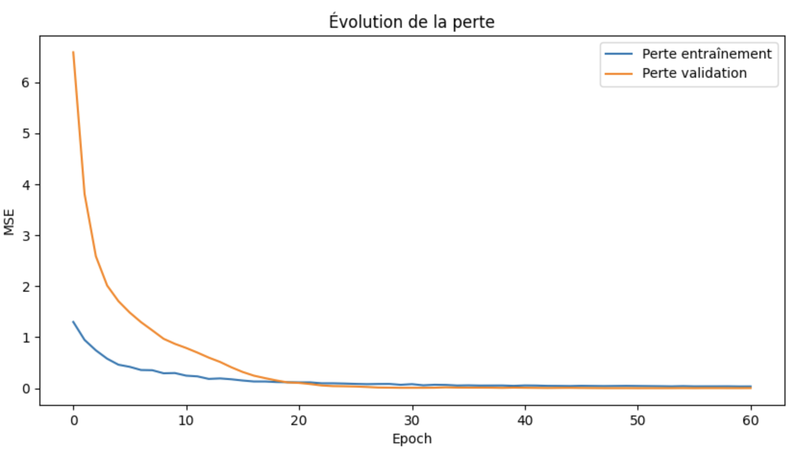
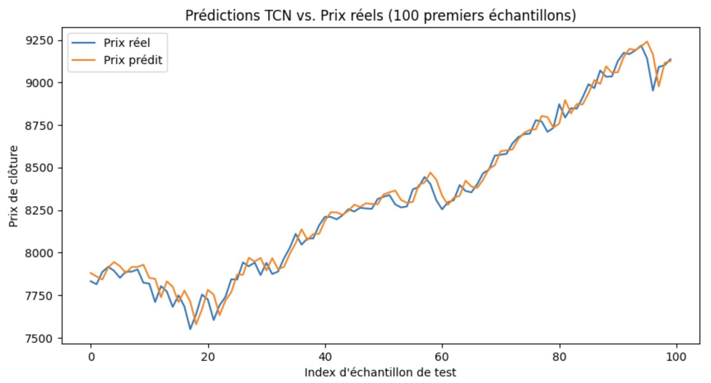
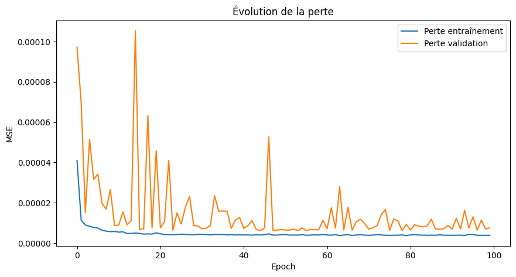
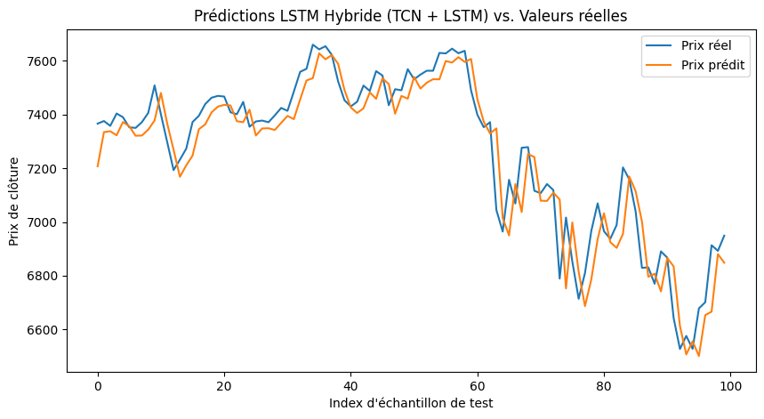

# Technical & Fundamental Analysis in Stock Market Prediction

  

  <a href="#introduction">Introduction</a> •
  <a href="#methodology">Methodology</a> •
  <a href="#results">Results</a> •
  <a href="#conclusion">Conclusion</a>

## Introduction

Predicting stock market movements is challenging due to the market's dynamic and stochastic nature. In our work, we focus on **technical analysis** to forecast short-term stock prices. While traditional models like LSTM have shown promise, recent advances with **Temporal Convolutional Networks (TCN)** offer an alternative way to capture both short- and long-term dependencies in time-series data through causal and dilated convolutions.

This project explores:
- How a simple TCN model can capture temporal patterns in stock prices.
- How a hybrid TCN+LSTM model can further enhance predictions by combining the strengths of both architectures.

## Methodology

### Data Preparation

- **Data Source:** Nasdaq-100 dataset with technical indicators.
- **Preprocessing:**  
  - Extraction of the `close` price.  
  - Normalization using `StandardScaler`.  
  - Creation of sliding window sequences (e.g. using 60 days of historical data to predict the next day).

### TCN Model

A Temporal Convolutional Network is a convolutional model designed for sequential data with causal (past-only) convolutions and dilated filters. In our implementation, we use a single-layer TCN architecture (TCN is in fact composed of multiple layers):

This architecture is summarized in the table below:

| Block          | Configuration                                                                             |
|----------------|-------------------------------------------------------------------------------------------|
| **TCN Layer 1**| 64 filters, kernel size 3, dilations `[1,2,4,8] (causal padding), return_sequences=False` |
| **Dense**      | 1 unit (final predicted closing price)                                                    |

### Hybrid TCN + LSTM Model

In our hybrid approach, we combine the TCN with LSTM layers to benefit from both models’ strengths:
- An initial LSTM layer (with `return_sequences=True`) extracts short-term dependencies.
- A TCN block (as described above) enriches the feature extraction by capturing long-term patterns.
- A second LSTM layer processes the TCN output to produce a summary representation.
- A final Dense layer outputs the prediction.
- 
Architecture:

| Block                                                                                          | Configuration                                                                                           |
|------------------------------------------------------------------------------------------------|---------------------------------------------------------------------------------------------------------|
| **TCN Layer 1**                                                                                | 64 filters, kernel size=2, dilations `[1,2,4,8] (causal padding), return_sequences=True`, Dropout = 0.2 |
| **LSTM**                                                                                       | 50 units, return_sequences=True                                                                         |
| **BatchNormalization**                                                                         |
| **Dense**                                                                                      | 1 unit (final predicted closing price)                                                                  |

This architecture is designed to balance short-term memory (via LSTM) with the TCN’s ability to capture long-range dependencies.

### Training

The dataset is split into:
- **Train:** 70%
- **Validation:** 15%
- **Test:** 15%

We use **EarlyStopping** and **ReduceLROnPlateau** to monitor the validation loss and adjust the learning rate accordingly. Loss curves are plotted on a logarithmic scale to better observe small values.

## Results

### TCN One-Day-Ahead Prediction

The TCN-based model, trained with a window of 2000 days to predict the next day’s closing price, converged steadily. The training and validation loss curves (plotted on a logarithmic scale) illustrate the learning process.

The prediction plot shows that the TCN model captures the main trend of the stock price:

*Performance example for the TCN model:*  
- **MAE:** 0.04  
- **R²:** 0.54  
- **Accuracy (5% tolerance):** 93.51%

### Hybrid TCN + LSTM Model

By integrating LSTM layers with the TCN block, our hybrid model further improves performance. The first LSTM layer processes the input sequence, the TCN block extracts robust temporal features, and a second LSTM layer refines the representation before the final prediction.

Additionally, our training curves indicate convergence (noisy) without significant overfitting.

## Conclusion

This study tends to show that the use of TCNs—especially when combined with LSTM layers in a hybrid architecture—can improve performance by capturing both long- and short-term dependencies.

The TCN’s causal and dilated convolutions enable it to efficiently extract temporal patterns, and when coupled with the LSTM’s capacity to model sequential dynamics, the hybrid model delivers pretty good accuracy. 
Future work may explore further parameter tuning (e.g., adjusting kernel size, dilation rates, and the number of stacks) and the integration of fundamental data for long-term forecasting

## References

- [TCN Python Class by Philippe Remy](https://github.com/philipperemy/keras-tcn/tree/master/tcn)
- [NASDAQ-100 Stock Price Data](https://www.kaggle.com/datasets/kalilurrahman/nasdaq100-stock-price-data)

